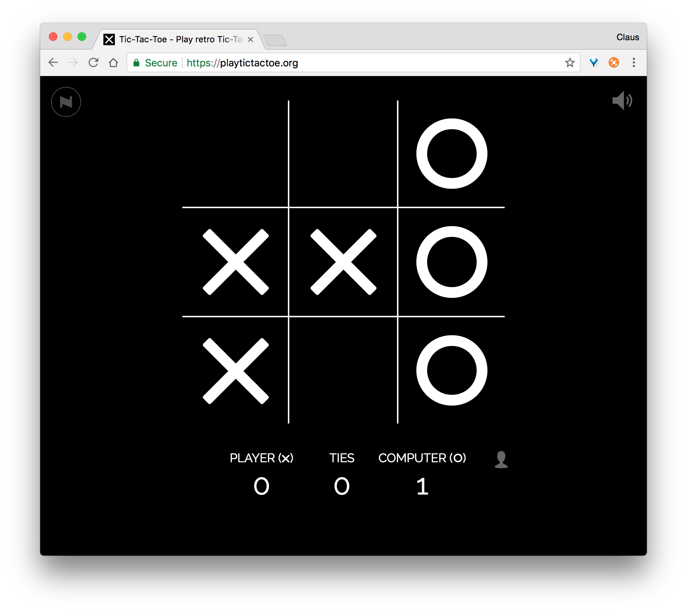

# UP Exercise Tic Tac Toe
<!--
_Start date: 08-03-2018_    
_Handin date: 14-03-2018 (12 PM)_    
_Presentation date: 15-03-2018 - 12:30 - 15:00_
-->

> This exercise is about using Unified Process.     
> It was previously used as a mandatory assignment, but your job is to go trough the 
> * **Inception phase** and 
> * **one iteration** of the **Elaboration phase.**    
> .    
> So you dont have to create the whole application!

## Assignment

Your job is to create a game of _Tic, Tac, Toe_
    
  
You do not have to make your game look or behave exactly like this, but you can use this as inspiration.

Further requirements to your application are:

1. The player should be able to play the game against the computer. 
	* Optionally, but not required, you could create a to player version of the game.
1. The player should be able create a user profile with containig a nickname and a password.
1. The user should login to play the game.
1. The results of the users played games should be stored in a database (How many wins, ties and losses the user did have)

The project should further more be a 

* Spring boot project

and it should contain:

* model
* View
* controller
* repostory using interface
* Service layer
* database

You should code your application using the "State Machine" principles.

The project should be deployed to AWS and a link for the website should be handed in.

This assignment can be done by using the topics we covered in class. You do not have to dicover new techniques. What you know is enough. On the other hand you are also allowed to use stuff we did not cover in class if you feel like it.    

## Handin
You should hand in your project on Fronter latest Wednesday 14th of december at 12pm and you should deploy you application to AWS. Link to this should be provided in the handin folder on Fronter. (REMEMBER YOU SHOULD NOT DO THIS!!)

&copy; clbo@kea.dk 03-2018 - (ed. UP part 06-11-2018)

